# Django Cheatsheet

## Files

When and where to use the Django files.

##### `project/settings.py`

| situation | what to do | description |
| --- | --- | --- |
| __accounts__ | 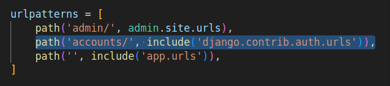 | When making login and logout pages, add a path that includes `'django.contrib.auth.urls'` to have the default urls and tools for this purpose |
| __apps__ | 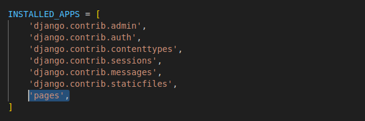 | After creating an app with `django-admin startapp`, you need to register it as in the `INSTALLED_APP` list |
| __custom users__ | 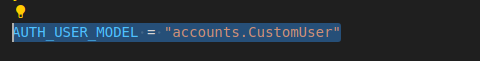 | When you're making a custom user, add `AUTH_USER_MODEL = "<app>.CustomUser"` to the settings _before_ running migrations to overwrite the making of the user model |
| __databases:MongoDB__ | 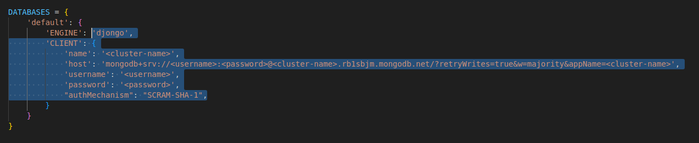 | To connect to MongoDB you have to register its engine (`djongo`, which you need to install with pip) and the `CLIENT`: a dictionary containing `'name'` of your cluster; `'host'` which is a string starting with _mongodb+srv_ that MongoDB provides when creating the cluster; `'username'` of your MongoDB account; `'password'` of your MongoDB account; and `'authMechanism'` with value `'SCRAM-SHA-1'` |
| __databases:postgres__ |  | To connect to postgres, you have to register its engine (`postgres_psycopg2` where by default you find `sqlite`), name (`my_db`), user to be accessed as, password of the user, host (`'127.0.0.1'` for localhost) and port (optional, `'5432'` for postgres) in the `default` dictionary of the `DATABASES` variable |
| __login__ | 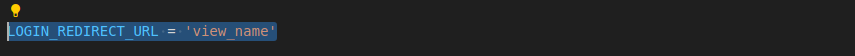 | When you're implementing a login page, add `LOGIN_REDIRECT_URL = 'view_name'` to your settings to automatically redirect to the chosen view after a successful login |
| __logout__ | 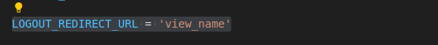 | When your user logs out, add `LOGOUT_REDIRECT_URL = 'view_name'` to your settings to automatically redirect to the chosen view after a successful logout |
| __middleware__ | 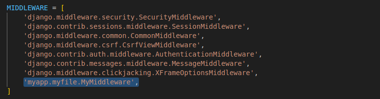 | To add a custom middleware to the `MIDDLEWARE` list, write its path as `app_name.file_name.function_or_class_name` |
| __permissions__ | 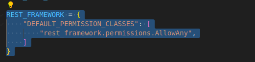 | To change the permissions on the project level, manipulate the `REST_FRAMEWORK` dictionary by changing the `"DEFAULT_PERMISSION_CLASSES"` list: in it, add `"rest_framework.permissions.<permission class>"`. Some of the permission classes are: `IsAuthenticated`, `IsAdminUser`, `IsAuthenticatedOrReadOnly`, `AllowAny`. |
| __static files__ | 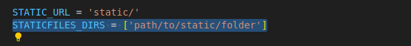 | If your static folder is outside of your app, you need to register the folder by adding the variable `STATICFILES_DIRS`, which is going to be a list containing a string path to the folder |
| __templates__ | 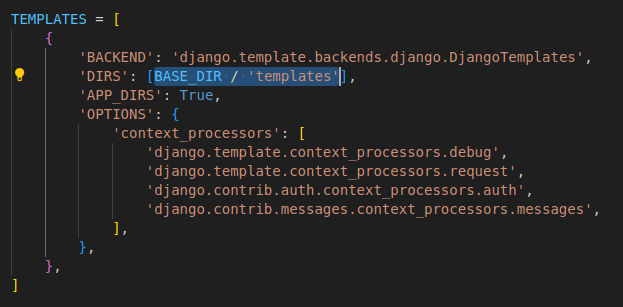 | If you want to use templates, you have to register them in the `'DIRS'` key of the `TEMPLATES` variable as a path to the folder |

##### `project/urls.py`

| situation | what to do | description |
| --- | --- | --- |
| __api authorisation__ | 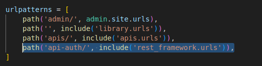 | To add a login menu in the admin view, add the following path to the project's urls `path('api-auth/', include('rest_framework.urls')),` |
| __class-based views__ | 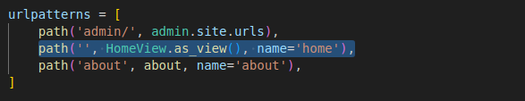 | Register a new url that shows a class-based view by passing the new url, the class-based view (imported from `app.views`) modified by the `.as_view()` method and a name that identifies the view (optional) |
| __function-based views__ | 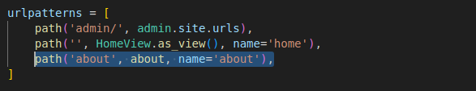 | Register a new url that shows a function-based view by passing the new url, the function-based view (imported from `app.views`) and a name that identifies the view (optional) |
| __include urls__ from apps | 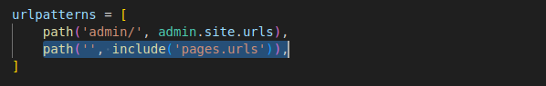 | Use the `include` function (imported from `django.urls`) to connect to other files that include urls |

#### `app/urls.py`

NB: This file is not created by default so you have to create it yourself when you make an app. You will also have to write in the `urlpatterns` list variable.

| situation | what to do | description |
| --- | --- | --- |
| __class-based views__ | 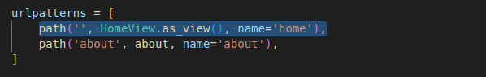 | Register a new url that shows a class-based view by passing the new url, the class-based view (imported from `.views`) modified by the `.as_view()` method and a name that identifies the view (optional) |
| __function-based views__ |  | Register a new url that shows a function-based view by passing the new url, the function-based view (imported from `.views`) and a name that identifies the view (optional) |

#### `app/admin.py`

NB: For this file to be helpful at all, you need to create a superuser in the terminal with the command `python manage.py createsuperuser`.

| situation | what to do | description |
| --- | --- | --- |
| **models** | 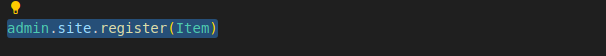 | When you make a model that you want to be able to see and manipulate from the admin page, you need to register it with `admin.site.register(MyModel)` where `MyModel` is imported from `.models` |

## Imports

Where to import any built-in module we have used so far from.

**Django:**

| import path | modules |
| --- | --- |
| `aiohttp` | `ClientSession` |
| `aiohttp.ClientSession` | `close()` |
| `asyncio` | `get_event_loop(* lst : list)`  `run(function : async func)` |
| `asyncio.get_event_loop()` | `close()`  `run_until_complete(function : async func)` |
| `django.apps` | `AppConfig` |
| `django.conf` | `settings` |
| `django.contrib` | `admin` |
| `django.contrib.auth` | `get_user_model` |
| `django.contrib.auth.admin` | `UserAdmin` |
| `django.contrib.auth.forms` | `UserChangeForm`  `UserCreationForm` |
| `django.contrib.auth.models` | `AbstractUser`  `User` |
| `django.core.asgi` | `get_asgi_application` |
| `django.core.wsgi` | `get_wsgi_application` |
| `django.db` | `models` |
| `django.db.models` | `Model` |
| `django.http` | `HttpResponse`  `HttpResponseRedirect`  `JsonResponse` |
| `django.shortcuts` | `redirect`  `render` |
| `django.test` | `SimpleTestCase`  `TestCase` |
| `django.urls` | `include`  `path`  `resolve`  `reverse`  `reverse_lazy` |
| `django.views.generic` | `CreateView`  `DetailView`  `FormView`  `ListView`  `TemplateView`  `View` |
| `django.views.generic.edit` | `DeleteView`  `UpdateView` |
| `pathlib` | `Path` |
| `rest_framework` | `permissions`  `serializers` `viewsets`  `routers` |
| `rest_framework.permissions` | `BasePermission`  `IsAdminUser`  `AllowAny`  `IsAuthenticatedOrReadOnly`  `IsAuthenticated` |
| `rest_framework.serializers` | `ModelSerializer` |