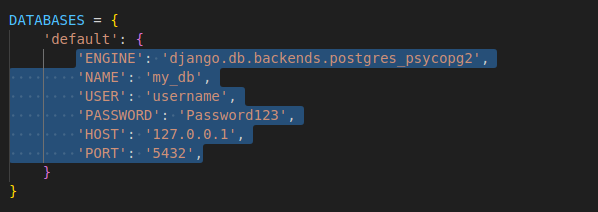
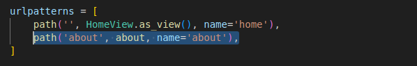

## Django Cheatsheet

#### When and where to use the Django files

##### `project/settings.py`

| situation | what to do | description |
| --- | --- | --- |
| __apps__ |  | After creating an app with `django-admin startapp`, you need to register it as in the `INSTALLED_APP` list |
| __databases: mongoDB__ |  | To connect to MongoDB you have to register its engine (`djongo`, which you need to install with pip) and the `CLIENT`: a dictionary containing `'name'` of your cluster; `'host'` which is a string starting with _mongodb+srv_ that MongoDB provides when creating the cluster; `'username'` of your MongoDB account; `'password'` of your MongoDB account; and `'authMechanism'` with value `'SCRAM-SHA-1'` |
| __databases: postgres__ |  | To connect to postgres, you have to register its engine (`postgres_psycopg2` where by default you find `sqlite`), name (`my_db`), user to be accessed as, password of the user, host (`'127.0.0.1'` for localhost) and port (optional, `'5432'` for postgres) in the `default` dictionary of the `DATABASES` variable |
| __static files__ |  | If your static folder is outside of your app, you need to register the folder by adding the variable `STATICFILES_DIRS`, which is going to be a list containing a string path to the folder |
| __templates__ |  | If you want to use templates, you have to register them in the `'DIRS'` key of the `TEMPLATES` variable as a path to the folder |

##### `project/urls.py`

| situation | what to do | description |
| --- | --- | --- |
| __class-based views__ |  | Register a new url that shows a class-based view by passing the new url, the class-based view (imported from `app.views`) modified by the `.as_view()` method and a name that identifies the view (optional) |
| __function-based views__ |  | Register a new url that shows a function-based view by passing the new url, the function-based view (imported from `app.views`) and a name that identifies the view (optional) |
| __include urls__ from apps |  | Use the `include` function (imported from `django.urls`) to connect to other files that include urls |

#### `app/urls.py`

NB: This file is not created by default so you have to create it yourself when you make an app. You will also have to write in the `urlpatterns` list variable.

| situation | what to do | description |
| --- | --- | --- |
| __class-based views__ |  | Register a new url that shows a class-based view by passing the new url, the class-based view (imported from `.views`) modified by the `.as_view()` method and a name that identifies the view (optional) |
| __function-based views__ |  | Register a new url that shows a function-based view by passing the new url, the function-based view (imported from `.views`) and a name that identifies the view (optional) |

#### `app/admin.py`

NB: For this file to be helpful at all, you need to create a superuser in the terminal with the command `python manage.py createsuperuser`.

| situation | what to do | description |
| --- | --- | --- |
| **models** |  | When you make a model that you want to be able to see and manipulate from the admin page, you need to register it with `admin.site.register(MyModel)` where `MyModel` is imported from `.models` |