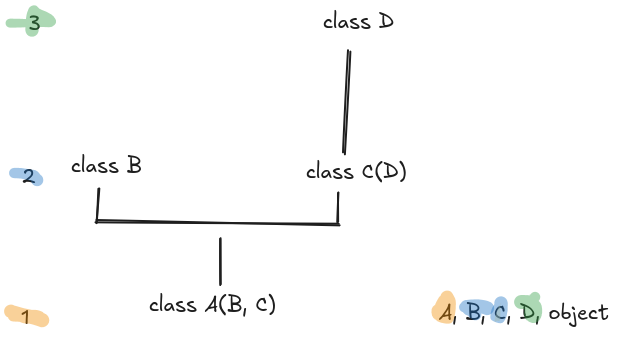

## ORM

ORM (Method Resolution Order) is the order in which classes are initialised based on how they inherit from each other.

If you think of it as a tree, the ORM always starts from the roots (the class we're considering) and goes up the branches on level at a time in the order that they are mentioned in the class declaration. The last class to be initialised is always `object`.

If we take class `A` from the image as an example, the first class to be initialised will be the root, `A`. The second level is composed of the inherited classes in the order that they appear, that means `B` and then `C`. Now we check the inherited classes from `B` and `C` and we follow the same procedure. In the image, `C` inherits from `D`, so we go one more level upwards and initialise class `D`. Lastly, as always and by default, `object`.